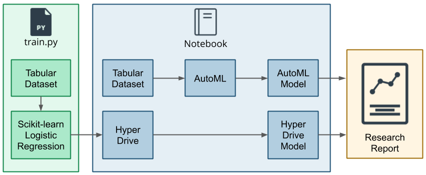

# :star: Optimizing an ML Pipeline in Azure

# :star: Overview

This project is part of the Udacity Azure ML Nanodegree.
In this project, we build and optimize an Azure ML pipeline using the Python SDK and a provided Scikit-learn model.
This model is then compared to an Azure AutoML run.

# :star: Summary

### **Problem Statement**

The dataset describes about the marketing campagins for a bank, which consists of the information about :-

- Bank client data (**attributes** :- age, job, marital, education, default, housing, loan, balance)
- The last contact of the current campaign (**attributes** :- contact, month, day, duration)
- Other (**attributes** :- campaign, Pdays, previous, poutcome)
  - **y** is the desired target, where we need to know whether client subscribed the term deposit or not (**yes** or **no**) . The dataset contains 32950 training data in CSV file and its a classification problem.

### :star: **Solution for the problem statement**

The above figure describes how to perform the problem statement in an effective way, there are two ways of approaching the problem:-

- To optimize the hyper parameter of custom coded model using a tool called **HyperDrive**. HyperDrive will help us to find the best parameter to the model compared to manual Hyperparameter tuning.
- **AutoML** which helps us to choose the best algorithm, which evaluates the different pipelines on its own and help us to find the best optimal solution in a faster way.

# :star: Scikit-learn Pipeline

### Pipeline architecture including data, HyperParameter tuning and classification algorithm.

### Benefits of the parameter sampler.

### Benefits of the early stopping policy.

- train.python scripts performs several operations they are listed as follows :-
  - It consists of import statements to load the libraries which we need to process in the experiment.
  - Need to import the CSV file which contains the marketing campaigns data into a TabularDataFactory method.
  - Cleans the data in clean_data() function method.
  - clean_data() function includes handling missing values, dropping NaN values and also dropped irrelevant columns which is not needed for the experiment, one hot encoding for categorical features, loads data into pandas dataframe.
  - Splitting dataset into training and testing set(80% training, 20% testing)
  - .fit method applies the logistic regression to the model and computes the accuracy score for the model.Files are saved in "./outputs/".

#### To use HyperDrive to tune HyperParameter

- **Select a sampling method** :- **RandomParameter Sampling** is used to randomly select a value for each hyperparameter, which can be a mix of discrete and continuous values.Here in code we need to search for parameter like "\__C" and "_ \_max_iter"
- **PrimaryMetric Goal** :- It is used to determine whether a higher value for a metric is better or worse. In this experiment primary metric is **accuracy**.We can maximize or minimize for betterment of model.
- **Estimators** :- estimators will be called with sampled hyperparameter.sklearn creates an estimator. It helps to simplify the tasks of specifying how a script is executed.

* The maximum total number of runs to craete and the maximum numbers of runs to execute concurrently.(**Note** :- If none, all runs are launched in parallel.The number of concurrent runs is gated on the resources available in the specified compute target. )
  - Need to ensure that the compute target has the available resources for the desired concurrency.
* **Bandit Policy** :- It is based on the slack criteria, frequency and delay interval for evaluation.
  - Slack_factor is the ratio used to calculate the allowed distance from the best performing experiment run.
  - evaluation_interval, frequency for applying the policy.The main advantage is if we have a certain number of failures, HyperDrive will stop looking for the answers.

Lastly, by submitting the hyperdrive run we need to get the best model the model with the tuned hyperparameters which gives the best accuracy score.The best value of the accuracy was found to be :- **0.9073**

### Algorithm

- Logistic Regression is a binary classification algorithm in which dependent variable is binary i,e
  1(True,Sucess),0(False,Failure). Goal is to find the best fitting model for independent and dependent variable in the relationship. Independent variable can be continous or binary, also called as **logit regression**, used in machine learning,deals with probability to measure the relation between dependent and independent variables.

# :star: AutoML

- Importing the csv file containing the marketing campaigns data into TabularDatasetFactory method.
- Importing "clean" function from train.python file to clean the dataset.
- Splitting the dataset into training set (80% of the data) & test set (20% of the data.)
- Preparing the AutoML Config by passing in the following:-  
   experiment_timeout_minutes=30  
   task="classification"  
   primary_metric="accuracy"  
   training_data=train_data  
   label_column_name="y"  
   n_cross_validations=2  
   max_concurrent_iterations=4  
   featurization='auto'
- Submitting the AutoML config.
- Finding the best run then saving the model.

# :star: Pipeline comparison

As we know that the above problem statement has two approachs :-

- HyperDrive
- AutoML

Both for HyperDrive and AutoML we need to create a workspace,import the data in the form of CSV file,clean it and process it through the model.**The difference between the two model's is :-**

HyperDrive must have a custom coded machine learning model.Otherwise, HyperDrive won't know which model to optimize the parameters for.HyperDrive consider different aspects to perform hyperparameter tuning they are :-

- Define a search space consisting of continuous and discrete parameters.
- Define a sampling method.
- Specify a primary metic to optimize.
- Specify an early termination policy.

AutoML doesn't require any of the above steps which has been performed by HyperDrive. In this experiment AutoML got slightly good accuracy score compared to HyperDrive model. As AutoML evaluates lots of different algorithm and create a pipeline on its own to give the best fit model for the dataset without manual effort.

- using HyperDrive: accuracy score = 0.9073
- AutoMl: accuracy score = 0.91502 (MaxAbsScaler, XGBoostClassifier)

# Future work

- We can consider different sampling parameters for example:- Bayesian sampling or Grid sampling for improving accuracy.
- By experimenting with different termination policy. In some sampling method we can prefer not using early termination policy if dataset is not too large.
- By improving metics

# References

- understanding of sampling methods [sampling](https://www.analyticsvidhya.com/blog/2019/09/data-scientists-guide-8-types-of-sampling-techniques/)
